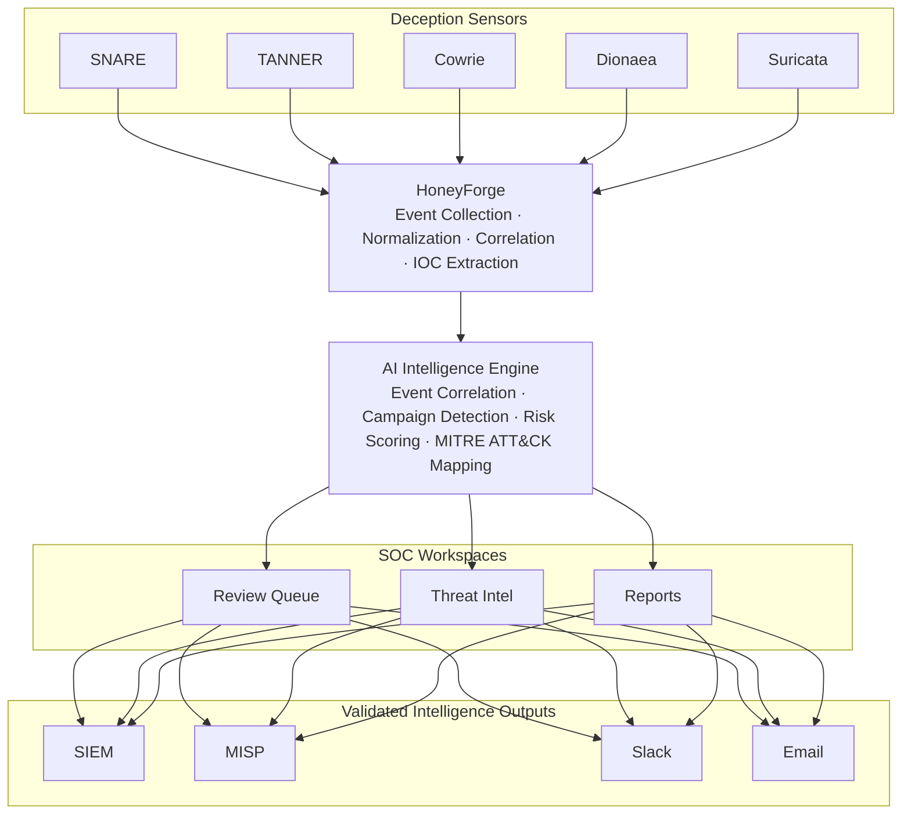

# HoneyForge — Architecture

---

## Platform Data Flow



### Flow summary

| Stage | Description |
|---|---|
| Deception Sensors | SNARE and TANNER serve web honeypots. Cowrie emulates SSH. Dionaea captures malware. Suricata provides IDS alerts. |
| HoneyForge | Collects raw sensor telemetry, normalizes events to a common schema, correlates related events, and extracts IOCs. |
| AI Intelligence Engine | Runs correlation, campaign detection, decoy risk scoring, and MITRE ATT&CK mapping across normalized events. |
| SOC Workspaces | Analysts investigate incidents in the Review Queue, track IOCs in Threat Intel, and consume generated Reports. |
| Validated Intelligence Outputs | Confirmed intelligence is forwarded to SIEM platforms, MISP for IOC sharing, Slack for alerting, and Email for reporting. |

---

## App Router Structure

```
app/
  page.tsx              # Root redirect → /dashboard
  (dashboard)/          # Route group — applies layout.tsx to all children
    layout.tsx          # Sidebar + Header + DataModeProvider wrapper
    dashboard/page.tsx  # Client component (uses DataModeContext)
    decoys/page.tsx
    ...
  login/page.tsx        # Outside (dashboard) group — no sidebar
  api/                  # Server-only API routes (AI calls, webhooks)
```

All dashboard routes are under the `(dashboard)` route group. The group's `layout.tsx` wraps the entire subtree in `DataModeProvider`, mounts `Sidebar` and `Header`, and calls `useRequireAuth()` to enforce login.

---

## DataModeContext

`contexts/DataModeContext.tsx` provides a `{ isDemoMode, setDemoMode }` context to every client component under the dashboard layout.

**Hydration safety**: The context initialises from `process.env.NEXT_PUBLIC_ENABLE_DEMO_MODE` so the SSR render matches the initial client render. `useSyncExternalStore` with a `honeyforge:demo-mode` CustomEvent keeps localStorage in sync across tabs without causing hydration mismatches.

```
SSR render:  isDemoMode = NEXT_PUBLIC_ENABLE_DEMO_MODE !== 'false'
After mount: isDemoMode = localStorage.getItem('hf_demo_mode') ?? env var
```

Pages that hold mutable state use the key-reset pattern — the default export wraps the page content in `key={String(isDemoMode)}` so the component fully remounts on mode change:

```typescript
export default function PageWrapper() {
  const { isDemoMode } = useDataMode()
  return <PageContent key={String(isDemoMode)} isDemoMode={isDemoMode} />
}
```

---

## Service Layer

```
services/
  mock/
    data/           # Static TypeScript objects — all mock data lives here
    index.ts        # Re-exports all MOCK_* constants
  api/
    index.ts        # Thin re-export shim; swap imports here to go live
  ai/
    *Service.ts     # AI service stubs — return mock data, no real calls
```

The `services/api/index.ts` file is the swap point: replace `from '@/services/mock'` with real fetch/RPC calls here, and every page automatically picks up real data without modification.

AI service files (`services/ai/`) are intentionally stubs. When connecting real AI:

1. Keep the service file as a mock/type definition layer.
2. Create a corresponding `app/api/ai/<service>/route.ts`.
3. Call the API route from the service using `fetch`.
4. Store API keys in `.env.local` server-side variables only — never in `NEXT_PUBLIC_` variables.

---

## Authentication

Auth uses Supabase SSR via `@supabase/ssr`.

- `store/authStore.ts` holds session state (Zustand).
- `useRequireAuth()` (called in the dashboard layout) redirects unauthenticated users to `/login`.
- `middleware.ts` is a pass-through placeholder; replace with `updateSession` from `@/lib/supabase/middleware` once Supabase env vars are configured.
- The actual security boundary is **Supabase Row Level Security** — the client-side guard is UX only.

---

## RBAC

User roles are typed as `UserRole = 'admin' | 'analyst' | 'viewer'`.

- `Sidebar` filters `NAV_ITEMS` by `item.roles` — items with no `roles` field are visible to all.
- Server-side enforcement belongs in Supabase RLS policies and API route middleware.

---

## State Management

| Store | Contents |
|---|---|
| `authStore` | `user`, `session`, `login()`, `logout()` |
| `uiStore` | `sidebarCollapsed`, `toggleSidebar()`, `theme`, `notificationCount` |

Both stores use Zustand v5 with `persist` middleware for localStorage-backed state.

---

## AI Intelligence Engine

The AI Intelligence Summary page (`/ai-intelligence-summary`) uses a service-per-concern architecture:

| Service | Responsibility |
|---|---|
| `eventCorrelationService` | Group events into correlation clusters |
| `campaignDetectionService` | Identify and track attacker campaigns |
| `decoyRiskScoringService` | Score decoys by composite risk formula |
| `iocEnrichmentService` | Multi-feed IOC reputation lookup |
| `mitreMappingService` | Map events to ATT&CK techniques |
| `aiSummaryService` | Generate executive summary and config |
| `recommendationEngineService` | Prioritised analyst recommendations |
| `suggestedActionService` | One-click action execution stubs |

All services are currently stubs returning mock data. See the Service Layer section above for the connection pattern.

---

## Key Type Conventions

- `source?: 'demo' | 'local' | 'database'` on `Decoy` — tracks data origin; demo records show the orange **DEMO** badge.
- `ThreatSeverity = 'critical' | 'high' | 'medium' | 'low'` — canonical severity scale used across all types.
- `UserRole = 'admin' | 'analyst' | 'viewer'` — RBAC roles.
